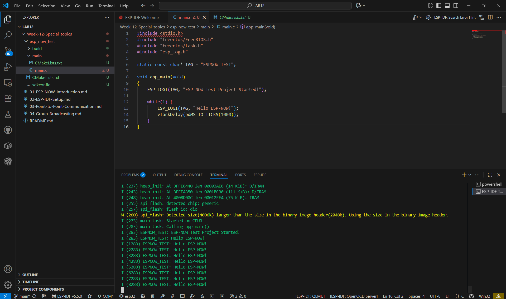
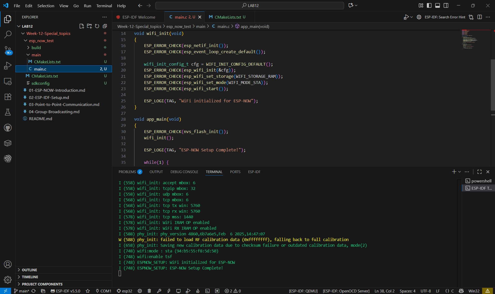

# ESP-NOW สำหรับ ESP32 ด้วย ESP-IDF
ESP-NOW Components
 

ESP-NOW Sender Process

ESP-NOW Receiver Process

Two-Way System
 

Challenge 1: Remote LED Control
 

Challenge 2: Sensor Data Collection
 

Challenge 3: Two-Way Chat System
 